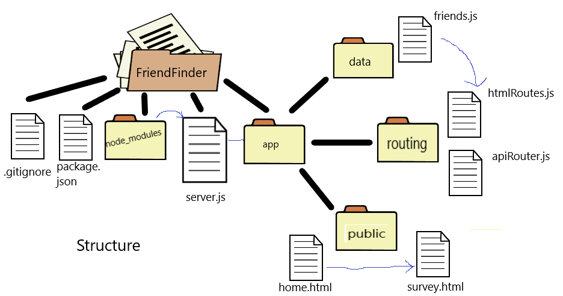
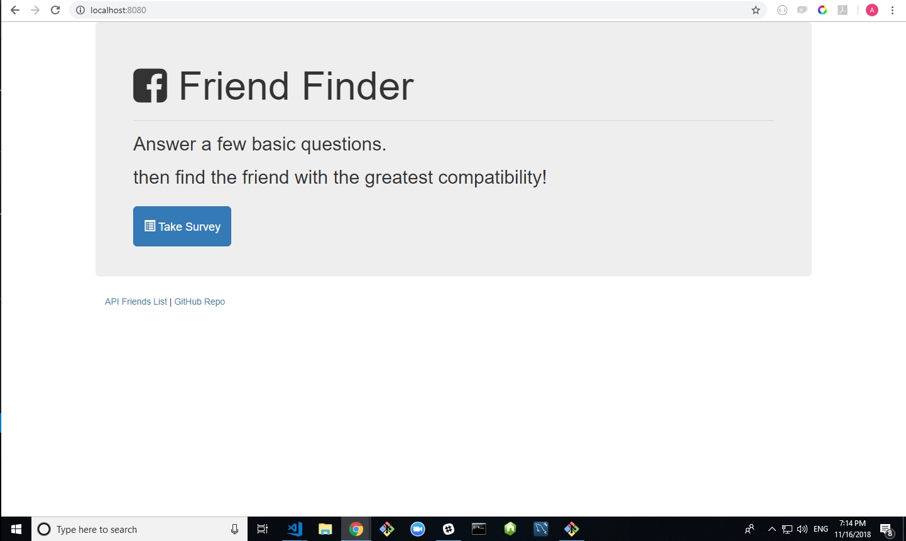
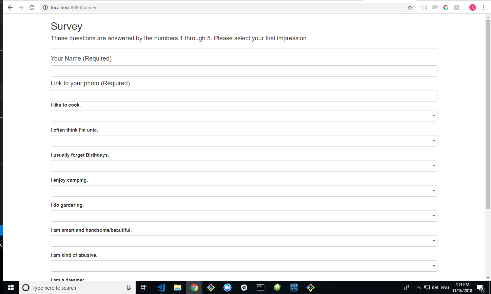
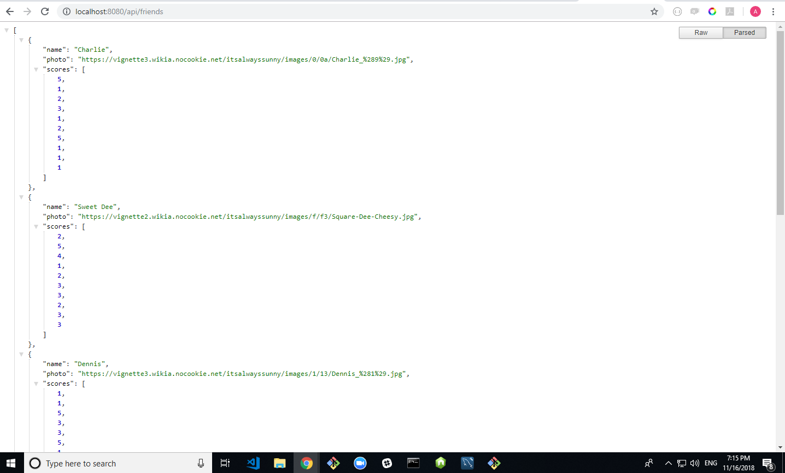

# FriendFinder
##  Homework-Boot Camp wk-13 Node and Express

- This application was made using Node and Express, as well as "express" and "path" basic packages. It utilizes the Express Methodes GET and POST.

- The application mocs a Dating Website. Running this application the user is prompted to fill a form requesting the name and photo of the user and a survey of 10 questions, with that information, the code will find the closest match to the score of the user. 
- The user is then informed what is the best match; name and image is rendered in a pop out window.
- Links to the list of all friends and to GitHub repository are included.

